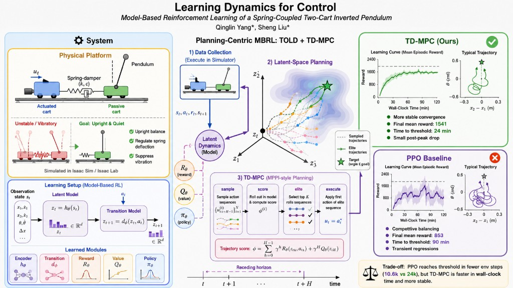

# Learning Dynamics for Control: Model-Based Reinforcement Learning of a Spring-Coupled Two-Cart Inverted Pendulum

Official code for the paper
**"Learning Dynamics for Control: Model-Based Reinforcement Learning of a
Spring-Coupled Two-Cart Inverted Pendulum"**
(Qinglin Yang, Sheng Liu, *Preprints.org*, 2026).
[](https://doi.org/10.20944/preprints202603.1250.v1)

A reinforcement-learning project for a custom **spring-coupled two-cart inverted
pendulum**, built on [NVIDIA Isaac Lab](https://isaac-sim.github.io/IsaacLab/). It
includes a from-scratch **TD-MPC** implementation, a **PPO** baseline via
[`rsl_rl`](https://github.com/leggedrobotics/rsl_rl), and a **MuJoCo sim-to-sim**
deployment script for validating trained TD-MPC policies.

If you use this code, please [cite the paper](#citation).



*Planning-centric model-based RL (TOLD + TD-MPC) on a spring-coupled two-cart
inverted pendulum: an actuated cart drives a passive, spring-coupled cart that
carries the pendulum. Compared with a PPO baseline, the TD-MPC agent converges
faster in wall-clock time and balances more stably.*

## The task

The system consists of two carts and a pole:

- **`cart1`** slides along a rail and is the only actively driven joint
  (a force/effort is applied to it).
- **`cart`** is connected to `cart1` through a spring; its motion is derived
  from `cart1` and the spring state.
- the **pole** hinges on `cart` and must be balanced upright.

The agent observes a 9-dimensional vector and outputs a 1-dimensional action
(the effort applied to `cart1`):

```
[sin(theta), cos(theta), pole_vel,
 cart1_pos, cart1_vel,
 cart_pos,  cart_vel,
 spring_length, spring_velocity]
```

## Repository structure

```
src/
├── algorithm/              # Core TD-MPC algorithm
│   ├── tdmpc.py
│   └── helper.py           # Episode / ReplayBuffer / model helpers
├── envs/
│   └── carts_pole/         # Isaac Lab environment definition
│       ├── cartspole.py        # Articulation (robot) configuration
│       └── cartspole_env.py     # DirectRLEnv + reward / observation logic
├── configs/                # Algorithm/runner configuration classes
│   ├── TDMPCRunnerCfg.py
│   └── PPORunnerCfg.py
├── wrappers/               # Environment wrappers
│   ├── tdmpc_wrapper.py        # Adapts the env to the TD-MPC agent
│   └── ppo_wrapper.py          # Adapts the env to rsl_rl (PPO)
├── utils/
│   └── logger.py
├── assets/                 # USD / MJCF assets
└── scripts/                # Runnable entry points
    ├── train.py                # Train TD-MPC or PPO (--algo)
    ├── evaluate.py             # Evaluate a TD-MPC checkpoint
    ├── play.py                 # Play a trained PPO checkpoint
    └── deploy_mujoco.py        # Sim-to-sim TD-MPC rollout in MuJoCo
```

## Requirements

- **Isaac Sim + Isaac Lab** (provides `isaaclab`, `omni.*`). Follow the
  [official Isaac Lab installation guide](https://isaac-sim.github.io/IsaacLab/main/source/setup/installation/index.html).
  These are **not** installed via pip.
- Remaining Python dependencies are listed in [`requirements.txt`](requirements.txt):

```bash
pip install -r requirements.txt
```

  This includes [`rsl_rl`](https://github.com/leggedrobotics/rsl_rl) (PyPI:
  `rsl-rl-lib`), which provides the PPO `OnPolicyRunner` baseline.

All training/evaluation scripts must be run with the Python interpreter from
your Isaac Lab environment, since they launch Isaac Sim on startup.

> **Paths.** Log directories default to `<repo>/logs` (override with `--log_dir`),
> and the MuJoCo model defaults to `src/assets/carts2pole.xml` (override with
> `--xml`). The Isaac Lab USD asset defaults to `src/assets/newcartspole.usd`;
> place your USD there or point to it with the `CARTSPOLE_USD` environment
> variable. Make sure the corresponding asset files exist before running.

## Usage

Run the entry points from the `scripts/` directory. Each script bootstraps the
`src/` source root onto `sys.path`, so they can be launched directly.

### Train

```bash
# TD-MPC (default)
python src/scripts/train.py --algo tdmpc --exp_name my_run --seed 42 --headless

# PPO baseline
python src/scripts/train.py --algo ppo --headless
```

Common flags: `--seed`, `--num_envs`, `--save_video`, `--save_model`,
`--headless`, `--enable_cameras` (the last two are injected by Isaac Lab's
`AppLauncher`).

### Evaluate a TD-MPC checkpoint

```bash
python src/scripts/evaluate.py --checkpoint /path/to/checkpoint.pt --episodes 10 --headless
```

### Play a PPO checkpoint

```bash
python src/scripts/play.py --checkpoint /path/to/model.pt --num_envs 1 --video --headless
```

### Sim-to-sim in MuJoCo

Validate a trained TD-MPC policy on the equivalent MuJoCo (MJCF) model:

```bash
python src/scripts/deploy_mujoco.py --checkpoint /path/to/checkpoint.pt
# optionally override the MJCF model with --xml /path/to/model.xml
```

## Logging

Training metrics are logged to the console and to [Weights & Biases](https://wandb.ai/).
Set `use_wandb` / project names in the config classes under `src/configs/`, or
disable W&B if you do not need it.

## Acknowledgements

This project builds on excellent open-source work:

- [**TD-MPC**](https://github.com/nicklashansen/tdmpc) by Nicklas Hansen et al. —
  the TD-MPC algorithm and parts of this implementation are adapted from the
  original repository.
- [**NVIDIA Isaac Lab**](https://github.com/isaac-sim/IsaacLab) — the simulation
  framework used to build and train the environment.
- [**rsl_rl**](https://github.com/leggedrobotics/rsl_rl) — used for the PPO
  baseline.

## Citation

If you find this work useful, please cite:

```bibtex
@article{yang2026learning,
  title   = {Learning Dynamics for Control: Model-Based Reinforcement Learning of a Spring-Coupled Two-Cart Inverted Pendulum},
  author  = {Yang, Qinglin and Liu, Sheng},
  journal = {Preprints.org},
  year    = {2026},
  doi     = {10.20944/preprints202603.1250.v1}
}
```

## License

Released under the [MIT License](LICENSE).
